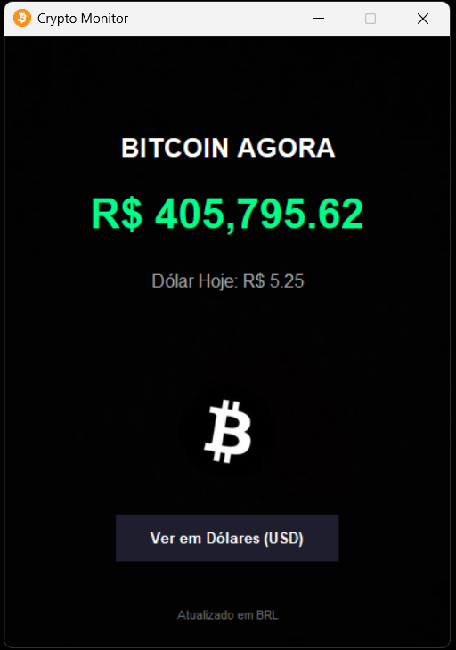
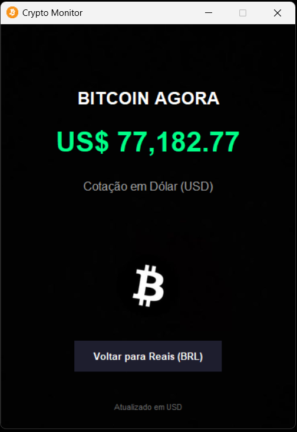

📈 Crypto Monitor - Bitcoin Tracker
Um aplicativo desktop leve e estilizado desenvolvido em Python para monitorar o preço do Bitcoin em tempo real. O sistema exibe a cotação tanto em Reais (BRL) quanto em Dólares (USD), com atualizações automáticas e alertas sonoros.

✨ Funcionalidades
Monitoramento em Tempo Real: Consome dados da API da Coinbase.

Conversão Automática: Exibe o preço do Dólar comercial (via AwesomeAPI) quando cotado em Reais.

Interface Gráfica (GUI): Design limpo com modo escuro (Dark Mode) usando Tkinter.

Atualização Automática: O sistema atualiza os valores a cada 1 minuto.

Alertas Sonoros: Reproduz um som discreto (.wav) a cada atualização automática.

Controle Manual: Botão para alternar instantaneamente entre BRL e USD sem tocar o som de alerta.

🛠️ Tecnologias Utilizadas
Python 3

Tkinter (Interface Gráfica Nativa)

Requests (Consumo de API)

Winsound/OS (Sistema de áudio e arquivos)

Aqui está um modelo de README.md (o arquivo de apresentação do GitHub) pronto para copiar e colar. Ele é simples, profissional e explica exatamente o que o seu projeto faz e como rodar.

Crie um arquivo chamado README.md na pasta do seu projeto e cole o seguinte conteúdo:

📈 Crypto Monitor - Bitcoin Tracker
Um aplicativo desktop leve e elegante desenvolvido em Python para monitorar o preço do Bitcoin em tempo real. O sistema exibe a cotação tanto em Reais (BRL) quanto em Dólares (USD), com atualizações automáticas e alertas sonoros.

✨ Funcionalidades
Monitoramento em Tempo Real: Consome dados da API da Coinbase.

Conversão Automática: Exibe o preço do Dólar comercial (via AwesomeAPI) quando cotado em Reais.

Interface Gráfica (GUI): Design limpo com modo escuro (Dark Mode) usando Tkinter.

Atualização Automática: O sistema atualiza os valores a cada 1 minuto.

Alertas Sonoros: Reproduz um som discreto (.wav) a cada atualização automática.

Controle Manual: Botão para alternar instantaneamente entre BRL e USD sem tocar o som de alerta.

🛠️ Tecnologias Utilizadas
Python 3

Tkinter (Interface Gráfica Nativa)

Requests (Consumo de API)

Winsound/OS (Sistema de áudio e arquivos)

📝 APIs Utilizadas
Coinbase API (Preço do Bitcoin)

AwesomeAPI (Cotação do Dólar)

Desenvolvido para fins de estudo e monitoramento de mercado. 🚀

## 📸 Screenshots

  
  &nbsp; &nbsp; &nbsp; &nbsp;
  

